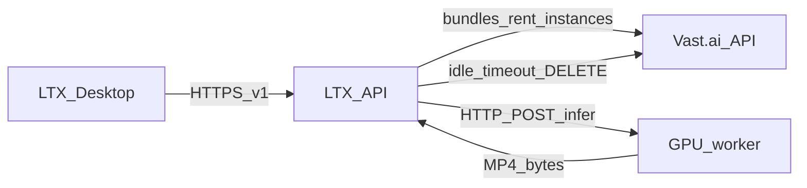

# Deployment: **ltx-api** (GCP) + GPU worker (Vast.ai)

The HTTP service is **`ltx-api`** (same name as the Python package). In `vastai` mode it coordinates GPU lifecycle and forwards inference to **`ltx-gpu-worker`** on the GPU host.

## Architecture



- **ltx-api** (`LTX_API_INFERENCE_BACKEND=vastai`): no PyTorch in this image ([`deploy/Dockerfile.ltx-api`](../../../deploy/Dockerfile.ltx-api)). Forwards jobs to the worker over HTTP.
- **GPU worker**: `ltx-api[real]` + `ltx-gpu-worker` ([`worker/server.py`](../src/ltx_api/worker/server.py)). Default port **8765**; Vast must map **8765/tcp** → public **HostPort**.

**GCP + Cloud Build:** step-by-step runbook → [`deploy/GCP-DEPLOY.md`](../../../deploy/GCP-DEPLOY.md).

## GCP VM + Docker Compose

On the VM (from repo root):

```bash
cp deploy/.env.example deploy/.env
# edit deploy/.env — set LTX_API_VAST_API_KEY, LTX_API_AUTH_TOKEN, LTX_API_PUBLIC_BASE_URL, etc.

docker compose -f deploy/docker-compose.yml --env-file deploy/.env up -d --build
```

Health: `GET http://<vm>:8080/health`

## Vast.ai modes

### A) Fixed worker URL (no auto-provision)

Set:

```bash
LTX_API_VAST_WORKER_BASE_URL=http://<public_ip>:<mapped_8765>
```

**ltx-api** skips Vast create/destroy. Idle destroy is disabled for this mode.

### B) Auto-provision + idle destroy

Leave `LTX_API_VAST_WORKER_BASE_URL` empty. Set `LTX_API_VAST_API_KEY` and tune search knobs (`LTX_API_VAST_GPU_*`, `LTX_API_VAST_LABEL`, …).

On first `/v1/*` inference request **ltx-api**:

1. Searches bundles and creates an instance (same idea as `kt-ltx-2/scripts/launch_vastai.sh`).
2. Polls until the instance is `running` and `ports` exposes `8765/tcp` → `HostPort`.
3. Polls `GET http://<public_ip>:<host_port>/health` until OK.
4. `POST /infer` on the worker for each pipeline call.

After `LTX_API_VAST_IDLE_TIMEOUT_SECONDS` without inference, it `DELETE`s the instance.

**Important:** The rented image must **start the GPU worker** and **publish port 8765**. Use [`deploy/worker_setup.sh`](../../../deploy/worker_setup.sh) on the instance (SSH/rsync) or bake startup into your Vast template.

## GPU worker setup

1. Sync or clone this repo on the instance (e.g. `/workspace/LTX-2`).
2. Run `bash deploy/worker_setup.sh` (installs `uv`, `ltx-api[real]`, downloads distilled checkpoint + upscaler; you still need **Gemma** at `LTX_API_GEMMA_ROOT` per main README).
3. Export model paths and start:

```bash
export LTX_API_CHECKPOINT_PATH=...
export LTX_API_SPATIAL_UPSAMPLER_PATH=...
export LTX_API_GEMMA_ROOT=...
export LTX_WORKER_HOST=0.0.0.0
export LTX_WORKER_PORT=8765
cd /workspace/LTX-2
uv run ltx-gpu-worker
```

## LTX Desktop: cold GPU UX

When using “API generation” against **ltx-api**, the Desktop shows phase **`warming_gpu`** (“Starting GPU instance…”) while the blocking HTTP request is in flight (after uploads, before the video returns). See `LTX-Desktop` `video_generation_handler.py` + `use-generation.ts`.

## Environment reference

All settings use prefix `LTX_API_` (see `Settings` in [`config.py`](../src/ltx_api/config.py)). [`deploy/.env.example`](../../../deploy/.env.example) lists the Vast-related entries.

## Local Python package layout

The **ltx-api** image installs **only** `packages/ltx-api` without `[real]`. For a dev venv with GPU + pipelines:

```bash
uv pip install -e './packages/ltx-api[real,dev]'
```
